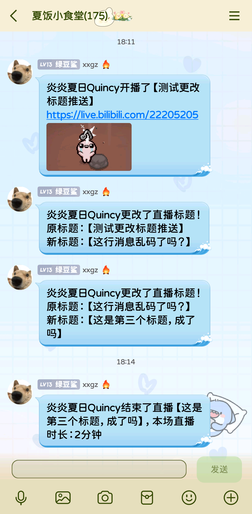

# QuincyDataKeeper
## 这是什么？
这是一个搭配QQ机器人 [DDBot](https://github.com/cnxysoft/DDBOT-WSa) 使用的bilibili直播推送功能扩展后端，需要搭配DDBot的模板使用，可以实现主播<b><font color="blue">更改直播标题提醒</b></font>，以及下播时显示<b><font color="blue">本场直播持续时间</b></font>。
## 使用说明
本工具在`23466端口`监听请求，当接收到`GET`请求后根据请求参数的不同返回不同的消息。
### 访问地址：
`http://localhost:23466/livedata`
### 请求参数：
| 参数名 | 数据类型 | 值 |
|:-------|:--------|:----|
| id    | 字符串  | 主播昵称|
| status| 字符串  | 直播状态，只能是online或offline|
| title | 字符串  | 直播标题|

### 响应
| 参数名 | 数据类型 | 值 |
|:-------|:---------|:----|
| action    | 字符串  | 主播行为，可选值有：<br/>begin（首次开播）<br/>rename（更改直播标题）<br/>end（下播）|
| prevTitle| 字符串  | 前序标题，仅action为rename时有值|
| timeSpan | 字符串  | 直播时长，仅action为end时有值|

## 示例
以下为作者自用```notify.group.bilibili.live.tmpl```，可供参考。
```
{{ if .living -}}
{{- $resp := httpGet "http://localhost:23466/livedata" (dict "id" .name "status" "online" "title" .title) | toGJson -}}
{{- if eq ($resp.Get "action").String "rename" -}}
{{ .name }}更改了直播标题！
原标题：【{{ coalesce ($resp.Get "prevTitle").String "[错误]获取前序标题失败" }}】
新标题：【{{ .title }}】
{{- else -}}
{{ .name }}开播了【{{ .title }}】
{{ .url -}}
{{ pic .cover "[封面]" }}
{{- end -}}
{{- else -}}
{{- $resp := httpGet "http://localhost:23466/livedata" (dict "id" .name "status" "offline" "title" .title) | toGJson -}}
{{ .name }}结束了直播【{{ .title }}】，本场直播时长：{{ coalesce ($resp.Get "timeSpan").String "[错误]获取开播时长失败" }}
{{- end -}}
```

## 效果图


## 鸣谢
- 感谢[DDBot](https://github.com/cnxysoft/DDBOT-WSa)项目提供的易用的QQ机器人框架；
- 感谢@空空喵Youyi 提供的思路点拨。